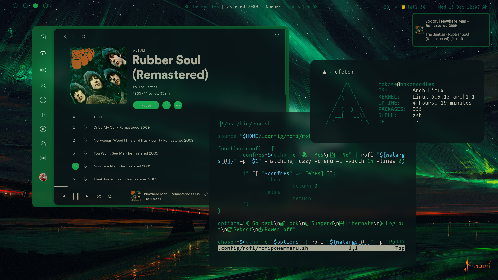
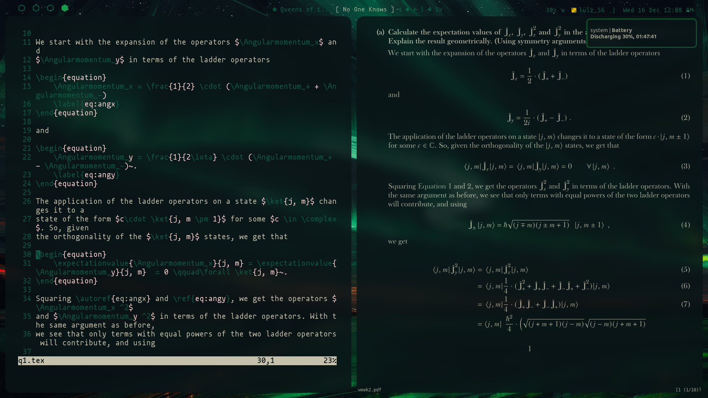

# dotfiles

Place to keep track of my config files, often used across devices.

Floating Money Shot

Actually tiled and working

## Dependencies

Basic:

- `i3-gaps`
- `polybar`
- `picom-ibhagwan`AUR
- `lightdm`
- `rofi`
- `dunst`
- `alacritty`

System control and utilities

- `pulseaudio`
- `playerctl`
- `light` (instead of xbacklight because I have an AMD GPU)
- `flameshot`
- `kitty` (used for popups as an alternate terminal for `nmtui` etc)

For dynamic coloring as configured:

- `pywal`
- `pywal-discord`AUR
- `wal-telegram`git
- `spicetify`AUR / with dribbblish

Fonts etc:

- Mononoki Nerd Font

Programs from screenshots

- `spotify`
- `firefox` with `minimal-functional-fox`
- `ufetch`AUR

Full package list in `.config/package-list`.
